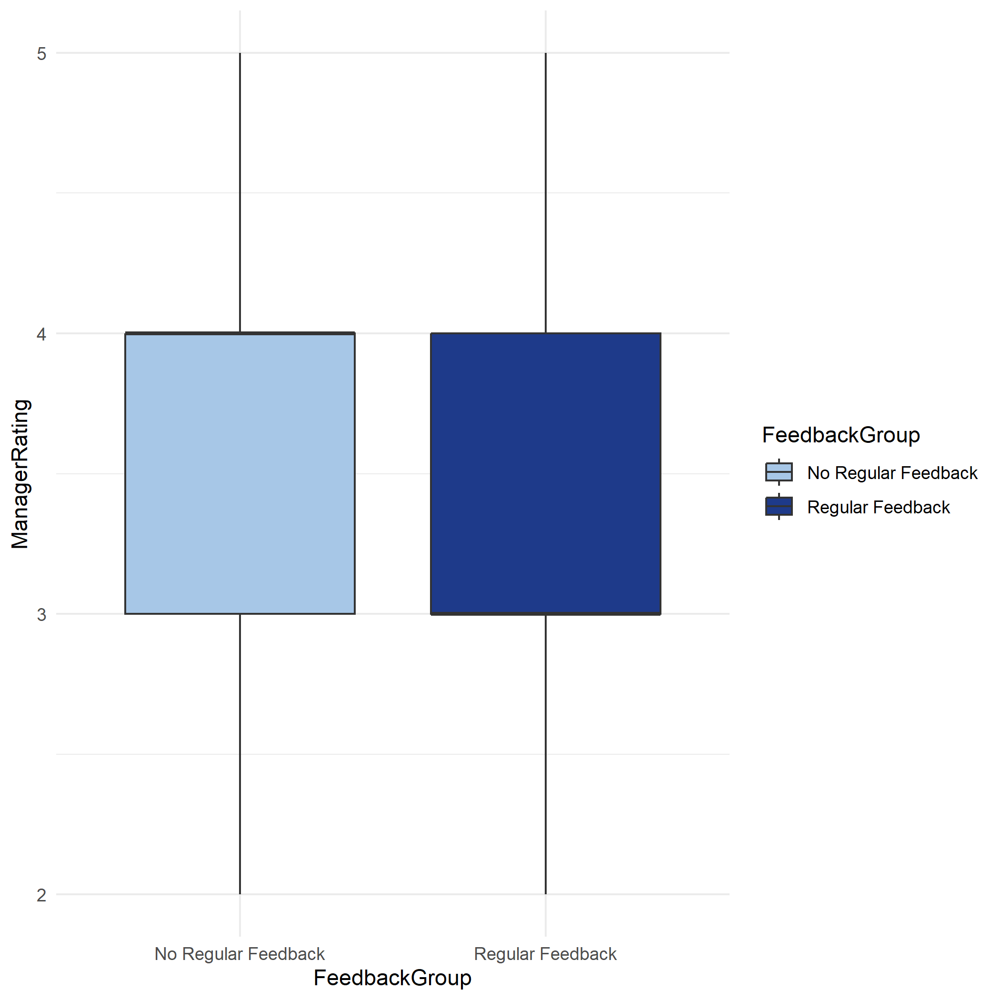

# Employee Performance Statistical Analysis

## Project Overview

This project analyzes employee performance and feedback data using statistical modelling and regression analysis techniques in R.

The objective of the project was to investigate whether employees who receive regular feedback perform better than those who do not using real world HR datasets.

---

## Dataset Information

- Total records analyzed: 6,709
- Datasets used:
  - `Employees.csv`
  - `PerformanceRating.csv`

The datasets contain employee performance ratings, training opportunities, job satisfaction, work life balance, self ratings, and workplace related attributes.

---

## Tools & Technologies

- R
- dplyr
- ggplot2
- readr
- caret

---

## Data Preprocessing & Cleaning

The following preprocessing techniques were applied:

- Dataset merging using `EmployeeID`
- Duplicate record removal
- Missing value handling
  - Median imputation for numeric variables
  - Mode imputation for categorical variables
- Data validation for rating ranges
- Standardization of column names
- Whitespace trimming in categorical variables

---

## Exploratory Data Analysis

The project includes:

- Histogram distribution analysis
- Q-Q plot normality checking
- Boxplots
- Bar charts
- Time series analysis
- Comparative group analysis

---

## Statistical Techniques Used

The following inferential statistical methods were applied:

- Independent T-Test
- One-Way ANOVA
- Chi Square Test
- Pearson Correlation Analysis

---

## Predictive Analytics

### Multiple Linear Regression
Used to analyze factors affecting employee performance ratings.

### Logistic Regression
Used to classify employees as high or low performers.

---

## Key Findings

- Multiple Linear Regression achieved R² = 0.729
- Logistic Regression achieved **84.4% prediction accuracy**
- No strong statistical evidence was found that regular feedback significantly improves employee performance

---

## Files Included

- `employee_analysis.R` → Complete R analysis script
- `Employee_Performance_Presentation.pptx` → Project presentation slides
- `Images/` → Generated visualizations and analysis outputs

---

## Visualizations

The project includes:

- Histogram plots
- Q-Q plots
- Boxplots
- Time series visualizations
- Regression outputs
- Comparative statistical graphs

---

## Sample Visualizations

### Boxplot Analysis

